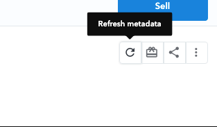
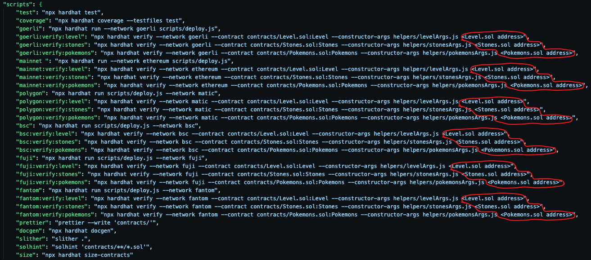

# <!----> Pokemons-Evolution <!---->
> There are 4 contracts: erc-20 standard Level.sol burnable implementation, erc-1155 Stones.sol burnable implementation, erc-1155 Pokemons.sol implementation and PokemonStorage.sol with all [data](https://pokemondb.net/evolution) of evolution chains

## 📁 Table of Contents
* [General Info](#-general-information)
* [Test Already Deployed Contracts](#-test-already-deployed-contracts)
* [Technologies Used](#-technologies-used)
* [Features](#-features)
* [Requirements For Initial Setup](#-requirements-for-initial-setup)
* [Setup](#-setup)
* [Contact](#-contact)


## 🚩 General Information
- Each user wishing to mint Pokemon required to pay mint fee
- The user can check if his Pokémon can evolve and in what way: using NFT `stone` or erc-20 `level` tokens
- After that, the user can buy `level` tokens from the Level.sol contract and `stone` tokens from Stones.sol
- And then the user can use the required token to evolve his NFT Pokemon, while receiving a new NFT of the next Pokemon in the evolutionary chain
- During evolution, `level` and `stone` tokens are burned 


## 🧪 Test Already Deployed Contracts

Try already deployed contract on mumbai test network
- [here](https://mumbai.polygonscan.com/address/0x0a680E2225a3e2103571AeB5d2B1da3f39766B78#readContract) Level.sol
- [here](https://mumbai.polygonscan.com/address/0x992c7Ac4eC6e63479a2Aa03Cd6A2a973c68F0D1b#readContract) Stones.sol
- [here](https://mumbai.polygonscan.com/address/0xb9276ba30c6Dc4884054EE60d82A3C59CC50e2ee#writeContract) Pokemons.sol

You can also visit openSea Testents to see and interact with the collection [here](https://testnets.opensea.io/collection/pokemons-evolution).
### NOTE
In order to quick update of Metadata on opensea page just click "Refresh Metadata" button


<!---->


 
## 💻 Technologies Used
- ipfs
- hh coverage
- slither
- docgen
- solhint

## 🌟 Features
- all 905 Pokemons with metadata and additional combat stats are waiting on OpenSea to be minted
- original game evolution chains implemented
- contract checked with security tools
- 100% coverage of tests

## 👀 Requirements For Initial Setup
- Install [NodeJS](https://nodejs.org/en/), should work with any node version below 16.16.0
- Install [Hardhat](https://hardhat.org/)

## 📟 Setup
### 1. 💾 Clone/Download the Repository
### 2. 📦 Install Dependencies:
```
$ cd repository_file
$ npm install
```
### 3. 🔍 .env environment variables required to set up
Create .env file inside project folder
- You can get your ethereum or testnet API key [here](https://infura.io/dashboard/ethereum),[here](https://www.alchemy.com) or any other service that allow you to connect to the nodes
- You can get your private key from your wallet (Don't share your private key with untrusted parties) 
- You can get your etherscan API -key [here](https://etherscan.io/myapikey).
- You can get your polygonscan API -key [here](https://polygonscan.com/myapikey).
- You can get your bscscan API -key [here](https://bscscan.com/myapikey).
- You can get your avalanche API -key [here](https://snowtrace.io/myapikey).
- You can get your fantom API -key [here](https://ftmscan.com/myapikey).
- LEVEL_ADDRESS(address of Level.sol) will be available after deploying contracts
- STONES_ADDRESS(address of Stones.sol) will be available after deploying contracts
```
PRIVATE_KEY = <Private key of your wallet u want to deploy contracts from>

GOERLI_API = <Goerli API key>
MAINNET_API = <Ethereum mainnet API key>
ETHERSCAN_KEY = <Etherscan API key in order to verify your contracts>

POLYGON_API = <Polygon API key>
MUMBAI_API = <Mumbai API key>
POLYGONSCAN_KEY = <Etherscan API key in order to verify your contracts>

BSC_TESTNET_API = <BSC API key>
BSCSCAN_KEY = <Etherscan API key in order to verify your contracts>

AVALANCHE_FUJI_API = <Avalanche API key>
SNOWTRACE_KEY = <Etherscan API key in order to verify your contracts>

FANTOM_TESTNET_API = <Fantom API key>
FTMSCAN_KEY = <Etherscan API key in order to verify your contracts>

INITIAL_LEVEL_SUPPLY = <Example: 1000000000000000000000>
LEVEL_TOKEN_PRICE = <Example: 200000>
STONES_TOKEN_PRICE  = <Example: 200000>
MINT_POKEMON_FEE  = <Example: 10000000>
UPGRADE_IN_LEVEL_FEE  = <Example: 16000000000000000000>
MAX_SUPPLY = <Example: 100000>
LEVEL_ADDRESS = <Level.sol address>
STONES_ADDRESS = <Level.sol address>

```


### 4. ⚠️ Run Tests
```
$ npm run test
```

```
$ npm run coverage
```

### 5. 🚀 Deploy contract
> There are goerli, mainnet, polygon, mumbai, bsc, avalanche, fuji and fantom networks in config file. You can deploy to any of them, or add any other network. Hovewer, Opensea supports Ethereum and Polygon, so examples to deploy and verify these contracts in these networks are below. 
- Deploy to GOERLI
```
$ npm run goerli
``` 
- Deploy to ETH mainnet
```
$ npm run mainnet
``` 
- Deploy to POLYGON/MUMBAI
```
$ npm run polygon
``` 

### NOTE
insert current Level.sol and Stones.sol contract address into your environment variables(.env file)
``` 
LEVEL_ADDRESS = <Level.sol address>
STONES_ADDRESS = <Level.sol address>
``` 

### 6. ✏️ Insert current contract addresses into package.json


### 7. 📜 Verify contracts depending on the network
- Verify GOERLI
```
$ npm run goerli:verify:level
$ npm run goerli:verify:stones
$ npm run goerli:verify:pokemons
``` 
- Verify ETH mainnet
```
$ npm run mainnet:verify:level
$ npm run mainnet:verify:stones
$ npm run mainnet:verify:pokemons
``` 
- Verify POLYGON/MUMBAI
```
$ npm run polygon:verify:level
$ npm run polygon:verify:stones
$ npm run polygon:verify:pokemons
``` 


## 💬 Contact
Created by [@LESKOV](https://www.linkedin.com/in/ivan-leskov-4b5664189/) - feel free to contact me!
